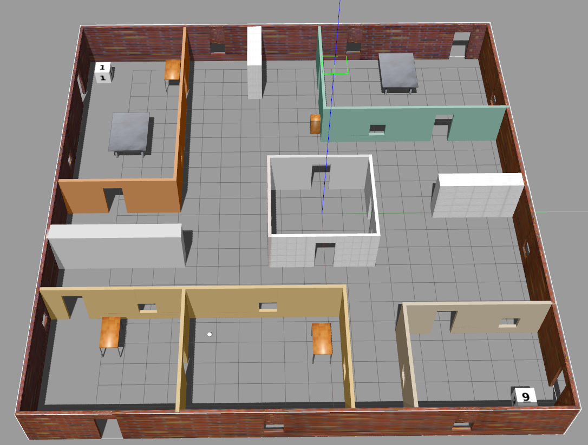
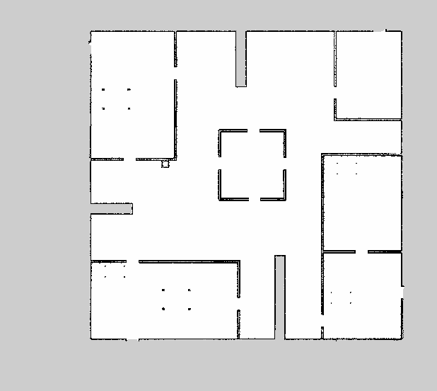
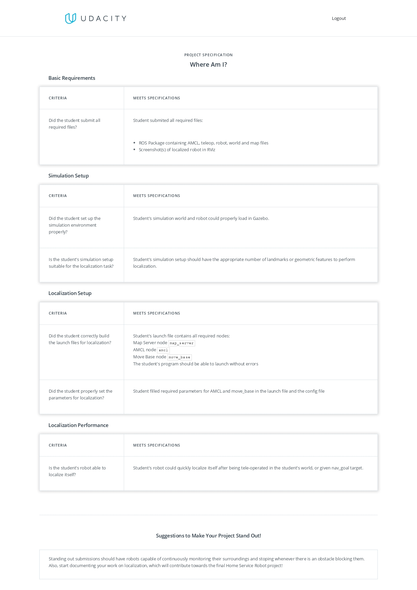

# Betabot Localization and Navigation

- [Betabot Localization and Navigation](#betabot-localization-and-navigation)
  - [Project Description](#project-description)
  - [GUID](#guid)
  - [Project Rubric](#project-rubric)
  - [After you implement the pkg state your reflection below](#after-you-implement-the-pkg-state-your-reflection-below)
  - [Part I: Map (map_server)](#part-i-map-mapserver)
    - [In your own words how maps are represented in ROS?](#in-your-own-words-how-maps-are-represented-in-ros)
    - [State 5 algorithm for SLAM and the ROS implementation](#state-5-algorithm-for-slam-and-the-ros-implementation)
  - [Part II: Localization (amcl)](#part-ii-localization-amcl)
    - [In your own words how amcl works?](#in-your-own-words-how-amcl-works)
    - [Is there other better approaches to localize your robot rather than amcl?](#is-there-other-better-approaches-to-localize-your-robot-rather-than-amcl)
    - [What are the amcl limitations or the fail cases?](#what-are-the-amcl-limitations-or-the-fail-cases)
    - [Is amcl used in domain rather than Robotics?](#is-amcl-used-in-domain-rather-than-robotics)
  - [Part III: Navigation (move_base)](#part-iii-navigation-movebase)
    - [How many official local planner available in ROS?](#how-many-official-local-planner-available-in-ros)
    - [which local planner did you use?](#which-local-planner-did-you-use)
    - [In your own words how the local planner you selected works?](#in-your-own-words-how-the-local-planner-you-selected-works)
    - [How many official global planner available in ROS?](#how-many-official-global-planner-available-in-ros)
    - [which global planner did you use?](#which-global-planner-did-you-use)
    - [In your own words how the global planner you selected works?](#in-your-own-words-how-the-global-planner-you-selected-works)
    - [State your suggestion increase the overall performance?](#state-your-suggestion-increase-the-overall-performance)
    - [List the most time consuming problems you faced](#list-the-most-time-consuming-problems-you-faced)
    - [Demos](#demos)
    - [Screenshots](#screenshots)
      - [NAME:](#name)
      - [ID:](#id)

## Project Description 

Create a ROS package with custom launch files to localize the robot in an environment given the map and also to autonomous navigation. 

*Use the given [map](map/map2d.yaml) for the myoffice world [here](../betabot_gazebo/worlds/myoffice.world)* 

   
  

>NOTE: For the given map and a world the betabot robot should localize it self and move from currant pose to a given goal autonomously

## GUID
Follow where am I project from Udacity Software Robotics Engineer Nanodegree.

---
## Project Rubric

 

---

## After you implement the pkg state your reflection below 

---
## Part I: Map (map_server)

###  In your own words how maps are represented in ROS?
maps are represented in ros with two files according to map server service:image file and yaml file that descripes the map

###  State 5 algorithm for SLAM and the ROS implementation

| SLAM Algorithm | ROS implementation |
|:--------------:|:------------------:|
|     GMapping   |      gmapping      |
|      EKF       |                    |
|      SEIF      |                    |
|      EIF       |                    |
|    FastSLAM    |                    |
|    GraphSLAM   |                    |

---

## Part II: Localization (amcl)

### In your own words how amcl works?
it creates a particles that estimate the robot location and over the all particles it results the probability of the location of the robot.the particles are updated using the sensor data that the robot gets.
### Is there other better approaches to localize your robot rather than amcl?
extended kalman filter, markov localization and MCL these are the same performance or a little less.
but SLAM is a good approach to localize the robot.

### What are the amcl limitations or the fail cases?

### Is amcl used in domain rather than Robotics?
monte carlo algorithm is used widely in statistics and probability.
---

## Part III: Navigation (move_base)

### How many official local planner available in ROS?
many like:base_local_planner, asr_ftc_local_planner,dwa_local_planner,teb_local_planner ,eband_local_planner and adaptive_local_planner

### which local planner did you use?
base_local_planner

### In your own words how the local planner you selected works?
it passes the velocity and direction to the robot base given the local goal.it works as the controller for the robot.

### How many official global planner available in ROS?
one : global planner

### which global planner did you use?
global planner

### In your own words how the global planner you selected works?
it plans the path for the global goal.
---

### State your suggestion increase the overall performance?

### List the most time consuming problems you faced
understanding the project and how the amcl works and how to build the package with all the config files.
---

### Demos
Add unlisted youtube/drive videos

[Demo](yourlinkhere)
https://drive.google.com/file/d/1mCTZ9yRXi8BIAmLBMj5tY29mWf5oQLis/view?usp=sharing

### Screenshots
1. rviz with all navigation launchers from turtulbot
2. gazebo

---

#### NAME:Abdelrahman Aly Bedier
#### ID:201400473

---
